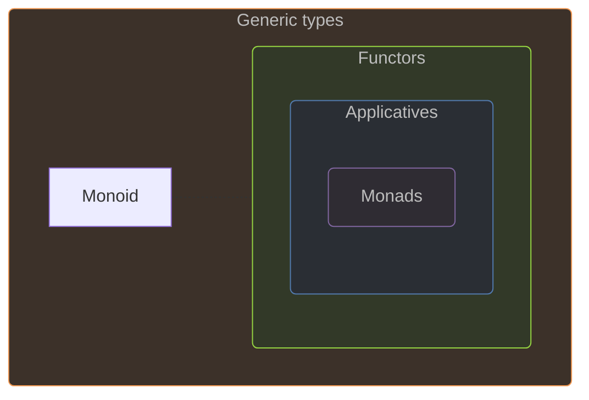

# 🚀 Functional patterns

## Introduction


#### Preliminary notes

The word **❝pattern❞** is used here rather than *concept* or *abstraction,* with a broader meaning than the ~~design patterns~~ from OOP *(object-oriented programming).*


### Origins

The patterns studied here are Monoid, Functor, Applicative, Monad. All these patterns are related, but we will only study the relationship between Functor, Applicative and Monad:




#### Other functional patterns

They are more functional patterns coming from category theory, but they are out of scope.


### F♯ hidden patterns

F♯ uses functional patterns under the hood:

- `Option` and `Result` are monadic types
- `Async` is monadic
- Collection types `Array`, `List` and `Seq` are monadic types too!
- Computation expressions can be monadic or applicative or monoidal

F♯ is designed so that developers don't need to know these patterns to code in F♯, including the use of computation expressions (CEs). However, in my opinion, it is preferable to have a basic understanding of these patterns in order to design computation expressions.

### General definition

In F♯, the functional patterns consist of:

- A type
- 1 or 2 operations on this type
- An eventual special instance of this type
- Some laws constraining/shaping the whole

The type is generally noted `M<'t>`, where `M` is a *generic type* and `'t` its type parameter referring to the type of elements that can contained `M`.

## Monoid

Etymology (Greek): `monos` *(single, unique)* • `eidos` *(form, appearance)*

≃ Type `T` defining a set with:

- Binary operation `+`: `T -> T -> T` \
  → To *combine* 2 elements into 1
- Neutral element `e` \
  (a.k.a. *identity*)

### Monoid laws

#### 1. **Associativity**

`+` is associative \
→ `a + (b + c)` ≡ `(a + b) + c`

#### 2. - **Identity Element**

`e` is combinable with any instance `a` of `T` without effects \
→ `a + e` ≡ `e + a` ≡ `a`

### Monoid examples

| Type      | `+`                 | Identity `e`          | Law 2                   |
|-----------|---------------------|-----------------------|-------------------------|
| `int`     | `+` *(add)*         | `0`                   | `i +  0  = 0  +  i = i` |
| `int`     | `*` *(multiply)*    | `1`                   | `i *  1  = 1  *  i = i` |
| `string`  | `+` *(concat)*      | `""` *(empty string)* | `s +  "" = "" +  s = s` |
| `'a list` | `@` (`List.append`) | `[]` *(empty list)*   | `l @  [] = [] @  l = l` |
| Functions | `>>` *(compose)*    | `id` (`fun x -> x`)   | `f >> id = id >> f = f` |

💡 The monoid is a generalization of the **Composite** *OO design pattern*
    🔗 [Composite as a monoid](https://blog.ploeh.dk/2018/03/12/composite-as-a-monoid/) *(by Mark Seemann)*

## Functor

### Functor definition

≃ Any generic type, noted `F<'T>`, with a `map` operation:

- Signature: `map: (f: 'T -> 'U) -> F<'T> -> F<'U>`

`map` preserves the structure: e.g. mapping a `List` returns another `List`.

### Functor laws

#### Law 1 - **Identity law**

Mapping the `id` function over a Functor `F` should not change `F`. \
→ `map id F` ≡ `F`

#### Law 2 - **Composition law**

Mapping the composition of 2 functions `f` and `g` is the same as \
mapping `f` and then mapping `g` over the result. \
→ `map (f >> g)` ≡ `map f >> map g`

### Functor examples

| Type            | Map          |
|-----------------|--------------|
| `Option<'T>`    | `Option.map` |
| `Result<'T, _>` | `Result.map` |
| `List<'T>`      | `List.map`   |
| `Array<'T>`     | `Array.map`  |
| `Seq<'T>`       | `Seq.map`    |

`Async<'T>` too, but through the `async` CE 📍

## Monad

### Monad definition

≃ Any generic type, noted `M<'T>`, with:

- Construction function `return`
  - Signature : `(value: 'T) -> M<'T>`
  - ≃ Wrap a value
- Chaining function `bind`
  - Noted `>>=` (`>` `>` `=`) as an infix operator
  - Signature : `(f: 'T -> M<'U>) -> M<'T> -> M<'U>`
  - Take a **monadic function** `f`
  - Call it with the eventual wrapped value(s)
  - Get back a new monadic instance of this type

### Monad laws

#### 1. **Left Identity**

`return` is a neutral starting point.

`return x |> bind f` ≡ `f x`

#### 2. **Right Identity**

`return` is a neutral element for the `bind` operation.

`m |> bind return` ≡ `m`

#### 3. **Associativity**

`bind` is associative \
→ Given 2 monadic functions `f: 'a -> M<'b>` and `g: 'b -> M<'c>`

- `(m >>= f) >>= g` ≡ `m >>= (fun x -> f x >>= g)`
- `(m |> bind f) |> bind g` ≡ `m |> bind (fun x -> f x |> bind g)`

💡 `bind` allows us to chain monadic functions, like the `|>` for regular functions

### Monad examples

| Type            | Bind            | Return            |
|-----------------|-----------------|-------------------|
| `Option<'T>`    | `Option.bind`   | `Some`            |
| `Result<'T, _>` | `Result.bind`   | `Ok`              |
| `List<'T>`      | `List.collect`  | `List.singleton`  |
| `Array<'T>`     | `Array.collect` | `Array.singleton` |
| `Seq<'T>`       | `Seq.collect`   | `Seq.singleton`   |

`Async<'T>` too, but through the `async` CE 📍

### Monad *vs* Functor

- A monad is also a **functor**
- `map` can be expressed in terms of `bind` and `return`: \
  `map f` ≡ `bind (f >> return)`

☝️ **Note:** Contrary to the monad with its `return` operation, the functor concept does not need a "constructor" operation.

### Monad alternative definition

A monad can be defined with the `flatten` operation instead of the `bind` \
→ Signature: `M<M<'T>> -> M<'T>`

Then, the `bind` function can be expressed in terms of `map` and `flatten`: \
→ `bind` ≡ `map >> flatten`

💡 This is why `bind` is also called `flatMap`.

### Regular functions *vs* monadic functions

| Function        | Op             | Signature                                                  |
|-----------------|----------------|------------------------------------------------------------|
| **Pipeline**    |                |                                                            |
| Regular         | `▷` *pipe*     | `(f: 'a -> 'b)    -> (x: 'a)    -> 'b`                     |
| Monadic         | `>>=` *bind*   | `(f: 'a -> M<'b>) -> (x: M<'a>) -> M<'b>`                  |
| **Composition** |                |                                                            |
| Regular         | `>>` *comp.*   | `(f: 'a -> 'b)    -> (g: 'b -> 'c)    -> ('a -> 'c)`       |
| Monadic         | `>=>` *fish*   | `(f: 'a -> M<'b>) -> (g: 'b -> M<'c>) -> (M<'a> -> M<'c>)` |

- Fish operator definition: `let (>=>) f g = fun x -> f x |> bind g` ≡ `f >> (bind g)`
- Composition of monadic functions is called *Kleisli composition*

### Monads *vs* Effects

**Effect** *(a.k.a. "side effect")*: \
→ change somewhere, inside the program *(state)* or outside \
→ examples:

- **I/O** *(Input/Output):* file read, console write, logging, network requests
- **State Management:** global variable update, database/table/row delete
- **Exceptions/Errors:** program crash
- **Non-determinism:** same input → ≠ value: random number, current time
- **Concurrency/Parallelism:** thread spawn, shared memory

Pure function causes no side effects → deterministic, predictable \
→ FP challenge: separate pure/impure code *(separation of concerns)*

Monads purposes:

- Encapsulate and sequence computations that involve effects,
- Maintain purity of the surrounding functional code,
- Provide a controlled environment in which effects can happen.

Dealing with a computation has an effect using monads means:

1. **Wrapping:** we don't get a value directly, we get a monadic value that represents the computation and its associated effect.
2. **Sequencing:** `bind` (or `let!` in a monadic CE) allows you to chain together effectful computations in a sequential order.
3. **Returning:** `return` wraps a **pure** value → computation w/o effects. \
   👉 The same monadic sequence can mix pure and effectful computations.

From the *caller* perspective, a function returning a monadic value is **pure.** \
→ Encapsulated effects only "happen" when monadic value is **evaluated.**

Examples in F♯:

- `Async`: by calling `Async.RunSynchronously`/`Start`
- `Option`/`Result`: by pattern matching and handle all cases
- `Seq`: by iterating the delayed sequence of elements

👉 Monads effectively bridge the gap between:

- mathematical elegance of pure functional programming
- practical necessity of interacting with an impure, stateful world

### Other common monads

☝️ *Rarely used in F♯, but common in Haskell*

- **Reader**: to access a read-only environment (like configuration) throughout a computation without explicitly passing it around
- **Writer**: accumulates monoidal values (like logs) alongside a computation's primary result
- **State**: manages a state that can be read and updated during a computation
- **IO**: handles I/O effects (disk, network calls...)
- **Free**: to build series of instructions, separated from their execution (interpretation phase)

## Applicative (Functor)

### Applicative definition

≃ Any generic type, noted `F<'T>`, with:

- Construction function `pure` (≡ monad's `return`)
  - Signature : `(value: 'T) -> F<'T>`
- Application function `apply`
  - Noted `<*>` (same `*` than in tuple types)
  - Signature : `(f: F<'T -> 'U>) -> F<'T> -> F<'U>`
  - Similar to functor's `map`, but where the mapping function `'T -> 'U` is wrapped in the applicative object

### Applicative laws

There are 4 laws:

- *Identity* and *Homomorphism* relatively easy to grasp
- *Interchange* and *Composition* more tricky

#### Law 1 - **Identity**

Same as the functor identity law applied to applicative:

| Pattern     | Equation                  |
|-------------|---------------------------|
| Functor     | `map   id        F` ≡ `F` |
| Applicative | `apply (pure id) F` ≡ `F` |

#### Law 2 - **Homomorphism**

💡 *Homomorphism* means a transformation that preserves the structure.

→ `pure` does not change the nature of values and functions so that we can apply the function to the value(s) either before or after being wrapped.

`(pure f) <*> (pure x)` ≡ `pure (f x)`
`apply (pure f) (pure x)` ≡ `pure (f x)`

#### Law 3 - **Interchange**

We can provide first the wrapped function `Ff` or the value `x`, wrapped directly or captured in `(|>) x` *(partial application of the `|>` operator used as function)*

`Ff <*> (pure x)` ≡ `pure ((|>) x) <*> Ff`

💡 When `Ff` = `pure f`, we can verify this law with the homomorphism law:

```txt
apply Ff (pure x)       | apply (pure ((|>) x)) Ff
apply (pure f) (pure x) | apply (pure ((|>) x)) (pure f)
pure (f x)              | pure (((|>) x) f)
                        | pure (x |> f)
                        | pure (f x)
```

#### Law 4 - **Composition**

- Cornerstone law: ensures that function composition works as expected within the applicative context.
- Hardest law, involving to wrap the `<<` operator (right-to-left compose)!

`Ff <*> (Fg <*> Fx)` ≡ `(pure (<<) <*> Ff <*> Fg) <*> Fx`

💡 Same verification:

```txt
(pure f) <*> ((pure g) <*> (pure x))    | (pure (<<) <*> (pure f) <*> (pure g)) <*> (pure x)
(pure f) <*> (pure g x)                 | (pure ((<<) f) <*> (pure g)) <*> (pure x)
pure (f (g x))                          | (pure ((<<) f g)) <*> (pure x)
pure ((f << g) x)                       | (pure (f << g)) <*> (pure x)
                                        | pure ((f << g) x)
```

### Applicative *vs* Functor

Every applicative is a functor \
→ We can define `map` with `pure` and `apply`:

`map f x` ≡ `apply (pure f) x`

💡 It was implied by the 2 identity laws.

### Applicative *vs* Monad

Every monad is also an applicative

- `pure` and `return` are just synonym
- `apply` can be defined using `bind`
  - given `mx` a wrapped value `M<'a>`
  - and `mf` a wrapped function `M<'a -> 'b>`
  - `apply mf mx` ≡ `mf |> bind (fun f -> mx |> bind (fun x -> return (f x)))`

`apply` *vs* `bind` 💡

- Where `apply` unwraps both `f` and `x`, 2 nested `bind`s are required.
- `bind` extra power comes from its ability to let its 2nd parameter — the function `'a -> M<'b>` — create a whole new computational path.

### Applicative: multi-param curried function

Applicative helps to apply to a function its arguments (e.g. `f: 'x -> 'y -> 'res`) when they are each wrapped (e.g. in an `Option`).

Let's try by hand:

```fsharp
let call f optionalX optionalY =
    match (optionalX, optionalY) with
    | Some x, Some y -> Some(f x y)
    | _ -> None
```

💡 We can recognize the `Option.map2` function.

🤔 Is there a way to handle any number of parameters?

The solution is to use `apply` N times, for each of the N arguments, first wrapping the function using `pure`:

```fsharp
// apply and pure for the Option type
let apply optionalF optionalX =
    match (optionalF, optionalX) with
    | Some f, Some x -> Some(f x)
    | _ -> None

let pure x = Some x

// ---

let f x y z = x + y - z
let optionalX = Some 1
let optionalY = Some 2
let optionalZ = Some 3
let res = pure f |> apply optionalX |> apply optionalY |> apply optionalZ
```

We can "simplify" the syntax by:

- Replacing the 1st combination of `pure` and `apply` with `map`
- Using the operators for map `<!>` and apply `<*>`

```fsharp
// ...
let res = pure f |> apply optionalX |> apply optionalY |> apply optionalZ

let res' = f <!> optionalX <*> optionalY <*> optionalZ
```

Still, it's not ideal!

### Applicative styles

The previous syntax is called **❝Style A❞** and is not recommended in modern F♯ by Don Syme - see its [Nov. 2020 design note](https://github.com/dsyme/fsharp-presentations/blob/master/design-notes/rethinking-applicatives.md).

When we use the `mapN` functions, it's called **❝Style B❞**.

The **❝Style C❞** relies on F♯ 5 `let! ... and! ...` in a CE like `option` from `FsToolkit`:

```fsharp
let res'' =
    option {
        let! x = optionalX
        and! y = optionalY
        and! z = optionalZ
        return f x y z
    }
```

👉 Avoid style A, prefer style C when a CE is available, otherwise style B.

### Applicative *vs* Monadic behaviour

The monadic behaviour is **sequential**: \
→ The computation #n+1 is done only after the computation #n.

The applicatives behave in **parallel**: \
→ All the computations for the arguments are done before applying them to the wrapped function.

👉 Even if monads can do more things, applicatives can be more performant on what they can do.

### Applicative parallel behaviour

The corollary is about the `Result` type and its `bind` function:

```fsharp
let bind (f: 'a -> Result<'b, _>) result =
    match result with
    | Ok x -> f x
    | Error e -> Error e
```

→ As soon as the current `result` is an `Error` case, `f` is ignored. \
→ On the 1st error, we "unplug".

Given the `Result<'ok, 'error list>` type, `apply` can accumulate errors:

```fsharp
let apply (f: Result<'a -> 'b, _>) result =
    match f, result with
    | Ok f, Ok x -> Ok(f x)
    | Error error, Ok _ -> Error [ error ]
    | Ok _, Error errors -> Error errors
    | Error error, Error errors -> Error(error :: errors) // 👈
```

💡 Handy for validating user input and reporting all errors.

🔗 [Validation with F# 5 and FsToolkit](https://www.compositional-it.com/news-blog/validation-with-f-5-and-fstoolkit/), Compositional IT

## Wrap up

### Functional patterns key points

| Pattern         | Key words                                                     |
|-----------------|---------------------------------------------------------------|
| **Monoid**      | `+` (combine), composite design pattern ++                    |
| **Functor**     | `map`, preserve structure                                     |
| **Monad**       | `bind`, functor, flatten, sequential composition, effects     |
| **Applicative** | `apply`, functor, multi-params function, parallel composition |

### Functional patterns in F♯

In F♯, these functional patterns are applied under the hood:

- Monoids with `int`, `string`, `list` and functions
- Monads with `Async`, `List`, `Option`, `Result`...
- All patterns when using computation expressions

☝️ After the beginner level, it's best to know the principles of these patterns, in case we need to write computation expressions.

#### 🤔 Make these patterns more explicit in F♯ codebases?

Meaning: what about F♯ codebases full of `monad`, `Reader`, `State`...?

- Generally **not recommmended**, at least by Don Syme
  - Indeed, the F♯ language is not designed that way.
  - Albeit, libraries such as *FSharpPlus* offer such extensions to F♯. 📍
- To be evaluated for each team: idiomatic *vs* consistency ⚖️ \
  → Examples:
  - **Idiomatic F♯** in .NET teams: using both C♯ and F♯ code
  - **Functional F♯** in FP team: using F♯, Haskell and/or OCaml

### Additional resources 🔗

- [*The "Map and Bind and Apply, Oh my!" series*](https://kutt.it/ebfGNA), F# for Fun and Profit
- [Applicatives IRL](https://thinkbeforecoding.com/post/2020/10/03/applicatives-irl), Jeremie Chassaing
