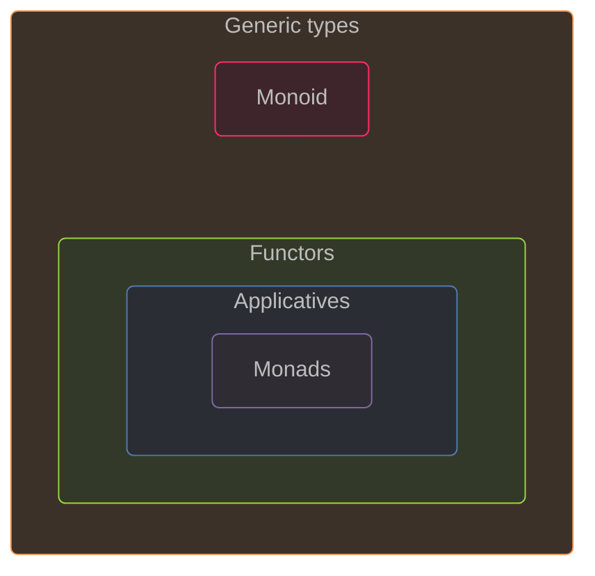

# 🚀 Functional patterns

## Introduction


**Preliminary notes**

The word **❝pattern❞** is used here rather than _concept_ or _abstraction,_ with a broader meaning than the ~~design patterns~~ from OOP _(object-oriented programming)._


### Origins

The patterns studied here are Monoid, Functor, Applicative, Monad. All these patterns are related, but we will only study the relationship between Functor, Applicative and Monad:




There are more functional patterns coming from category theory, but they are out of scope.


### F♯ hidden patterns

F♯ uses functional patterns under the hood:

* `Option` and `Result` are monadic types
* `Async` is monadic
* Collection types `Array`, `List` and `Seq` are monadic types too!
* Computation expressions can be monadic or applicative or monoidal

F♯ is designed so that developers don't need to know these patterns to code in F♯, including the use of computation expressions (CEs). However, in my opinion, it is preferable to have a basic understanding of these patterns in order to design computation expressions.

### General definition

In F♯, the functional patterns consist of:

* A type
* 1 or 2 operations on this type
* An eventual special instance of this type
* Some laws constraining/shaping the whole

The type is generally noted `M<'T>`, where `M` is a _generic type_ and `'T` its type parameter referring to the type of elements that can be contained in `M`.

## Monoid

Etymology (Greek): `monos` _(single, unique)_ • `eidos` _(form, appearance)_

≃ Type `T` defining a set with:

* Binary operation `+`: `T -> T -> T`\
  → To _combine_ 2 elements into 1
* Neutral element `e`\
  (a.k.a. _identity_)

### Monoid laws

#### 1. **Associativity**

`+` is associative\
→ `a + (b + c)` ≡ `(a + b) + c`

#### 2. **Identity Element**

`e` is combinable with any instance `a` of `T` without effect\
→ `a + e` ≡ `e + a` ≡ `a`

### Monoid examples

<table><thead><tr><th width="116">Type</th><th width="165">Operator</th><th width="213">Identity</th><th>Law 2</th></tr></thead><tbody><tr><td><code>int</code></td><td><code>+</code> <em>(add)</em></td><td><code>0</code></td><td><code>i + 0 = 0 + i = i</code></td></tr><tr><td><code>int</code></td><td><code>*</code> <em>(multiply)</em></td><td><code>1</code></td><td><code>i * 1 = 1 * i = i</code></td></tr><tr><td><code>string</code></td><td><code>+</code> <em>(concat)</em></td><td><code>""</code> <em>(empty string)</em></td><td><code>s + "" = "" + s = s</code></td></tr><tr><td><code>'a list</code></td><td><code>@</code> (<code>List.append</code>)</td><td><code>[]</code> <em>(empty list)</em></td><td><code>l @ [] = [] @ l = l</code></td></tr><tr><td>Functions</td><td><code>>></code> <em>(compose)</em></td><td><code>id</code> (<code>fun x -> x</code>)</td><td><code>f >> id = id >> f = f</code></td></tr></tbody></table>


#### Note

The monoid is a generalization of the **Composite** _OO design pattern_\
🔗 [Composite as a monoid](https://blog.ploeh.dk/2018/03/12/composite-as-a-monoid/) _(by Mark Seemann)_


## Functor

### Functor definition

≃ Any generic type, noted `F<'T>`, with a `map` operation:

* Signature: `map: (f: 'T -> 'U) -> F<'T> -> F<'U>`

`map` preserves the structure: e.g. mapping a `List` returns another `List`.

### Functor laws

#### Law 1 - **Identity law**

Mapping the `id` function over a Functor `F` should not change `F`.\
→ `map id F` ≡ `F`

#### Law 2 - **Composition law**

Mapping the composition of 2 functions `f` and `g` is the same as\
mapping `f` and then mapping `g` over the result.\
→ `map (f >> g)` ≡ `map f >> map g`

### Functor examples

| Type            | Map          |
| --------------- | ------------ |
| `Option<'T>`    | `Option.map` |
| `Result<'T, _>` | `Result.map` |
| `List<'T>`      | `List.map`   |
| `Array<'T>`     | `Array.map`  |
| `Seq<'T>`       | `Seq.map`    |

`Async<'T>` too, but through the `async` CE 📍

## Monad

### Monad definition

≃ Any generic type, noted `M<'T>`, with:

* Construction function `return`
  * Signature : `(value: 'T) -> M<'T>`
  * ≃ Wrap _(lift/elevate)_ a value
* Chaining function `bind`
  * Noted `>>=` (`>` `>` `=`) as an infix operator
  * Signature : `(f: 'T -> M<'U>) -> M<'T> -> M<'U>`
  * Take a **monadic function** `f`
  * Call it with the eventual wrapped value(s)
  * Get back a new monadic instance of this type

### Monad laws

#### 1. **Left Identity**

`return` then `bind` are neutral.\
→ `return >> bind f` ≡ `f`

#### 2. **Right Identity**

`bind return` is neutral, equivalent to the `id` function:\
→ `m |> bind return` ≡ `m |> id` ≡ `m`

☝️ It's possible because `return` has the signature of a monadic function.

#### 3. **Associativity**

`bind` is associative.

Given two monadic functions `f: 'a -> M<'b>` and `g: 'b -> M<'c>`\
→ `(m |> bind f) |> bind g` ≡ `m |> bind (f >> bind g)`

💡 `bind` allows us to chain monadic functions, like the `|>` for regular functions

### Monad examples

| Type            | Bind            | Return            |
| --------------- | --------------- | ----------------- |
| `Option<'T>`    | `Option.bind`   | `Some`            |
| `Result<'T, _>` | `Result.bind`   | `Ok`              |
| `List<'T>`      | `List.collect`  | `List.singleton`  |
| `Array<'T>`     | `Array.collect` | `Array.singleton` |
| `Seq<'T>`       | `Seq.collect`   | `Seq.singleton`   |

`Async<'T>` too, but through the `async` CE 📍

### Monad _vs_ Functor

* A monad is also a **functor**
* `map` can be expressed in terms of `bind` and `return`:\
  `map f` ≡ `bind (f >> return)`

☝️ **Note:** Contrary to the monad with its `return` operation, the functor concept does not need a "constructor" operation.

### Monad alternative definition

A monad can be defined with the `flatten` operation instead of the `bind`\
→ Signature: `M<M<'T>> -> M<'T>`

Then, the `bind` function can be expressed in terms of `map` and `flatten`:\
→ `bind` ≡ `map >> flatten`

💡 This is why `bind` is also called `flatMap`.

### Regular functions _vs_ monadic functions

<table><thead><tr><th width="126">Function</th><th width="103">Op</th><th>Signature</th></tr></thead><tbody><tr><td><strong>Pipeline</strong></td><td></td><td></td></tr><tr><td>Regular</td><td><code>▷</code> <em>pipe</em></td><td><code>(f: 'a -> 'b) -> (x: 'a) -> 'b</code></td></tr><tr><td>Monadic</td><td><code>>>=</code> <em>bind</em></td><td><code>(f: 'a -> M&#x3C;'b>) -> (x: M&#x3C;'a>) -> M&#x3C;'b></code></td></tr><tr><td><strong>Composition</strong></td><td></td><td></td></tr><tr><td>Regular</td><td><code>>></code> <em>comp.</em></td><td><code>(f: 'a -> 'b) -> (g: 'b -> 'c) -> ('a -> 'c)</code></td></tr><tr><td>Monadic</td><td><code>>=></code> <em>fish</em></td><td><code>(f: 'a -> M&#x3C;'b>) -> (g: 'b -> M&#x3C;'c>) -> ('a -> M&#x3C;'c>)</code></td></tr></tbody></table>

* Fish operator definition: `let (>=>) f g = fun x -> f x |> bind g` ≡ `f >> (bind g)`
* Composition of monadic functions is called _Kleisli composition_

### Monads _vs_ Effects

**Effect** _(a.k.a. "side effect")_:\
→ change somewhere, inside the program _(state)_ or outside\
→ examples:

* **I/O** _(Input/Output):_ file read, console write, logging, network requests
* **State Management:** global variable update, database/table/row delete
* **Exceptions/Errors:** program crash
* **Non-determinism:** same input → ≠ value: random number, current time
* **Concurrency/Parallelism:** thread spawn, shared memory

Pure function causes no side effects → deterministic, predictable\
→ FP challenge: separate pure/impure code _(separation of concerns)_

Monads purposes:

* Encapsulate and sequence computations that involve effects,
* Maintain purity of the surrounding functional code,
* Provide a controlled environment in which effects can happen.

Dealing with a computation that has an effect using monads means:

1. **Wrapping:** we don't get a value directly, we get a monadic value that represents the computation and its associated effect.
2. **Sequencing:** `bind` (or `let!` in a monadic CE) allows you to chain together effectful computations in a sequential order.
3. **Returning:** `return` wraps a **pure** value → computation w/o effects.\
   👉 A monadic sequence can mix pure and effectful computations.

From the _caller_ perspective, a function returning a monadic value is **pure.**\
→ Encapsulated effects only "happen" when monadic value is **evaluated.**

Examples in F♯:

* `Async`: by calling `Async.RunSynchronously`/`Start`
* `Option`/`Result`: by pattern matching and handle all cases
* `Seq`: by iterating the delayed sequence of elements

👉 Monads effectively bridge the gap between:

* mathematical elegance of pure functional programming
* practical necessity of interacting with an impure, stateful world

### Other common monads

☝️ _Rarely used in F♯, but common in Haskell_

* **Reader**: to access a read-only environment (like configuration) throughout a computation without explicitly passing it around
* **Writer**: accumulates monoidal values (like logs) alongside a computation's primary result
* **State**: manages a state that can be read and updated during a computation
* **IO**: handles I/O effects (disk, network calls...)
* **Free**: to build series of instructions, separated from their execution (interpretation phase)

## Applicative (Functor)

### Applicative definition

≃ Any generic type, noted `F<'T>`, with:

* Construction function `pure` (≡ monad's `return`)
  * Signature : `(value: 'T) -> F<'T>`
* Application function `apply`
  * Noted `<*>` (same `*` than in tuple types)
  * Signature : `(f: F<'T -> 'U>) -> F<'T> -> F<'U>`
  * Similar to functor's `map`, but where the mapping function `'T -> 'U` is wrapped in the applicative object

### Applicative laws

There are 4 laws:

* _Identity_ and _Homomorphism_ relatively easy to grasp
* _Interchange_ and _Composition_ more tricky

#### Law 1 - **Identity**

Same as the functor identity law applied to applicative:

| Pattern     | Equation                  |
| ----------- | ------------------------- |
| Functor     | `map id F` ≡ `F`          |
| Applicative | `apply (pure id) F` ≡ `F` |

#### Law 2 - **Homomorphism**

💡 _Homomorphism_ means a transformation that preserves the structure.

→ `pure` does not change the nature of values and functions so that we can apply the function to the value(s) either before or after being wrapped.

`(pure f) <*> (pure x)` ≡ `pure (f x)` `apply (pure f) (pure x)` ≡ `pure (f x)`

#### Law 3 - **Interchange**

We can provide the wrapped function `Ff` first or the value `x`, wrapped directly or captured in `(|>) x` _(partial application of the `|>` operator used as function)_

`Ff <*> (pure x)` ≡ `pure ((|>) x) <*> Ff`

💡 When `Ff` = `pure f`, we can verify this law with the homomorphism law:

```txt
apply Ff (pure x)       | apply (pure ((|>) x)) Ff
apply (pure f) (pure x) | apply (pure ((|>) x)) (pure f)
pure (f x)              | pure (((|>) x) f)
                        | pure (x |> f)
                        | pure (f x)
```

#### Law 4 - **Composition**

* Cornerstone law: ensures that function composition works as expected within the applicative context.
* Hardest law, involving to wrap the `<<` operator (right-to-left compose)!

`Ff <*> (Fg <*> Fx)` ≡ `(pure (<<) <*> Ff <*> Fg) <*> Fx`

💡 Same verification:

```txt
(pure f) <*> ((pure g) <*> (pure x))    | (pure (<<) <*> (pure f) <*> (pure g)) <*> (pure x)
(pure f) <*> (pure g x)                 | (pure ((<<) f) <*> (pure g)) <*> (pure x)
pure (f (g x))                          | (pure ((<<) f g)) <*> (pure x)
pure ((f << g) x)                       | (pure (f << g)) <*> (pure x)
                                        | pure ((f << g) x)
```

### Applicative _vs_ Functor

Every applicative is a functor\
→ We can define `map` with `pure` and `apply`:

`map f x` ≡ `apply (pure f) x`

💡 It was implied by the 2 identity laws.

### Applicative _vs_ Monad

Every monad is also an applicative

* `pure` and `return` are just synonym
* `apply` can be defined using `bind`
  * given `mx` a wrapped value `M<'a>`
  * and `mf` a wrapped function `M<'a -> 'b>`
  * `apply mf mx` ≡ `mf |> bind (fun f -> mx |> bind (fun x -> return (f x)))`

`apply` _vs_ `bind` 💡

* Where `apply` unwraps both `f` and `x`, 2 nested `bind`s are required.
* `bind` extra power comes from its ability to let its first parameter — the function `'a -> M<'b>` — create a whole new computational path.

### Applicative: multi-param curried function

Applicative helps to apply to a function its arguments (e.g. `f: 'x -> 'y -> 'res`) when they are each wrapped (e.g. in an `Option`).

Let's try by hand:

```fsharp
let call f optionalX optionalY =
    match (optionalX, optionalY) with
    | Some x, Some y -> Some(f x y)
    | _ -> None
```

💡 We can recognize the `Option.map2` function.

🤔 Is there a way to handle any number of parameters?

The solution is to use `apply` N times, for each of the N arguments, first wrapping the function using `pure`:

```fsharp
// apply and pure for the Option type
let apply optionalF optionalX =
    match (optionalF, optionalX) with
    | Some f, Some x -> Some(f x)
    | _ -> None

let pure x = Some x

// ---

let f x y z = x + y - z
let optionalX = Some 1
let optionalY = Some 2
let optionalZ = Some 3
let res = pure f |> apply optionalX |> apply optionalY |> apply optionalZ
```

Alternative syntax:

* Using the operators for map `<!>` and apply `<*>`
* Given we can replace the 1st combination of `pure` and `apply` with `map`

```fsharp
// ...
let res = f <!> optionalX <*> optionalY <*> optionalZ
```

Still, it's not ideal!

### Applicative styles

The previous syntax is called **❝Style A❞** and is not recommended in modern F♯ by Don Syme - see its [Nov. 2020 design note](https://github.com/dsyme/fsharp-presentations/blob/master/design-notes/rethinking-applicatives.md).

When we use the `mapN` functions, it's called **❝Style B❞**.

The **❝Style C❞** relies on F♯ 5 `let! ... and! ...` in a CE like `option` from `FsToolkit`:

```fsharp
let res'' =
    option {
        let! x = optionalX
        and! y = optionalY
        and! z = optionalZ
        return f x y z
    }
```

👉 Avoid style A, prefer style C when a CE is available, otherwise style B.

### Applicative _vs_ Monadic behaviour

The monadic behaviour is **sequential**:\
→ The computation #n+1 is done only after the computation #n.

The applicatives behave in **parallel**:\
→ All the computations for the arguments are done before applying them to the wrapped function.

👉 Even if monads can do more things, applicatives can be more performant on what they can do.

### Applicative parallel behaviour

The corollary is about the `Result` type and its `bind` function:

```fsharp
let bind (f: 'a -> Result<'b, _>) result =
    match result with
    | Ok x -> f x
    | Error e -> Error e
```

→ As soon as the current `result` is an `Error` case, `f` is ignored.\
→ On the 1st error, we "unplug".

Given the `Result<'ok, 'error list>` type, `apply` can accumulate errors:


```fsharp
let apply (rf: Result<'a -> 'b, 'err list>) (result: Result<'a, 'err list>) : Result<'b, 'err list> =
    match rf, result with
    | Ok f, Ok x -> Ok(f x)
    | Error fErrors, Ok _ -> Error fErrors
    | Ok _, Error xErrors -> Error xErrors
    | Error fErrors, Error xErrors -> Error(xErrors @ fErrors)
```


☝️ **Notes:**

* Errors are either accumulated _(line 6)_ or propagated _(lines 4, 5)_.
* At lines 4 and 6, `rf` is no longer a wrapped function but an `Error`. It happens after a first `apply` when there is an `Error` instead of a wrapped value _(lines 5, 6)_.

💡 Handy for validating inputs and reporting all errors to the user.\
🔗 [Validation with F# 5 and FsToolkit](https://www.compositional-it.com/news-blog/validation-with-f-5-and-fstoolkit/), Compositional IT

## Wrap up

### Functional patterns key points

<table><thead><tr><th width="142">Pattern</th><th>Key words</th></tr></thead><tbody><tr><td><strong>Monoid</strong></td><td><code>+</code> (combine), composite design pattern ++</td></tr><tr><td><strong>Functor</strong></td><td><code>map</code>, preserve structure</td></tr><tr><td><strong>Monad</strong></td><td><code>bind</code>, functor, flatten, sequential composition, effects</td></tr><tr><td><strong>Applicative</strong></td><td><code>apply</code>, functor, multi-params function, parallel composition</td></tr></tbody></table>

### Functional patterns in F♯

In F♯, these functional patterns are applied under the hood:

* Monoids with `int`, `string`, `list` and functions
* Monads with `Async`, `List`, `Option`, `Result`...
* All patterns when using computation expressions

☝️ After the beginner level, it's best to know the principles of these patterns, in case we need to write computation expressions.

#### 🤔 Make these patterns more explicit in F♯ codebases?

Meaning: what about F♯ codebases full of `monad`, `Reader`, `State`...?

* Generally **not recommended**, at least by Don Syme
  * Indeed, the F♯ language is not designed that way.
  * Although, libraries such as _FSharpPlus_ offer such extensions to F#. 📍
* To be evaluated for each team: idiomatic _vs_ consistency ⚖️\
  → Examples:
  * **Idiomatic F♯** recommended in .NET teams using both C♯ and F♯ code
  * **Functional F♯** can be considered in FP teams using several functional languages: F♯, Haskell, OCaml...

### Additional resources 🔗

* ["Understanding monoids" series](https://fsharpforfunandprofit.com/posts/monoids-without-tears/#series-toc) —F# for Fun and Profit
* ["Map and Bind and Apply, Oh my!" series](https://kutt.it/ebfGNA) —F# for Fun and Profit
* [Applicatives IRL](https://thinkbeforecoding.com/post/2020/10/03/applicatives-irl) —Jeremie Chassaing
